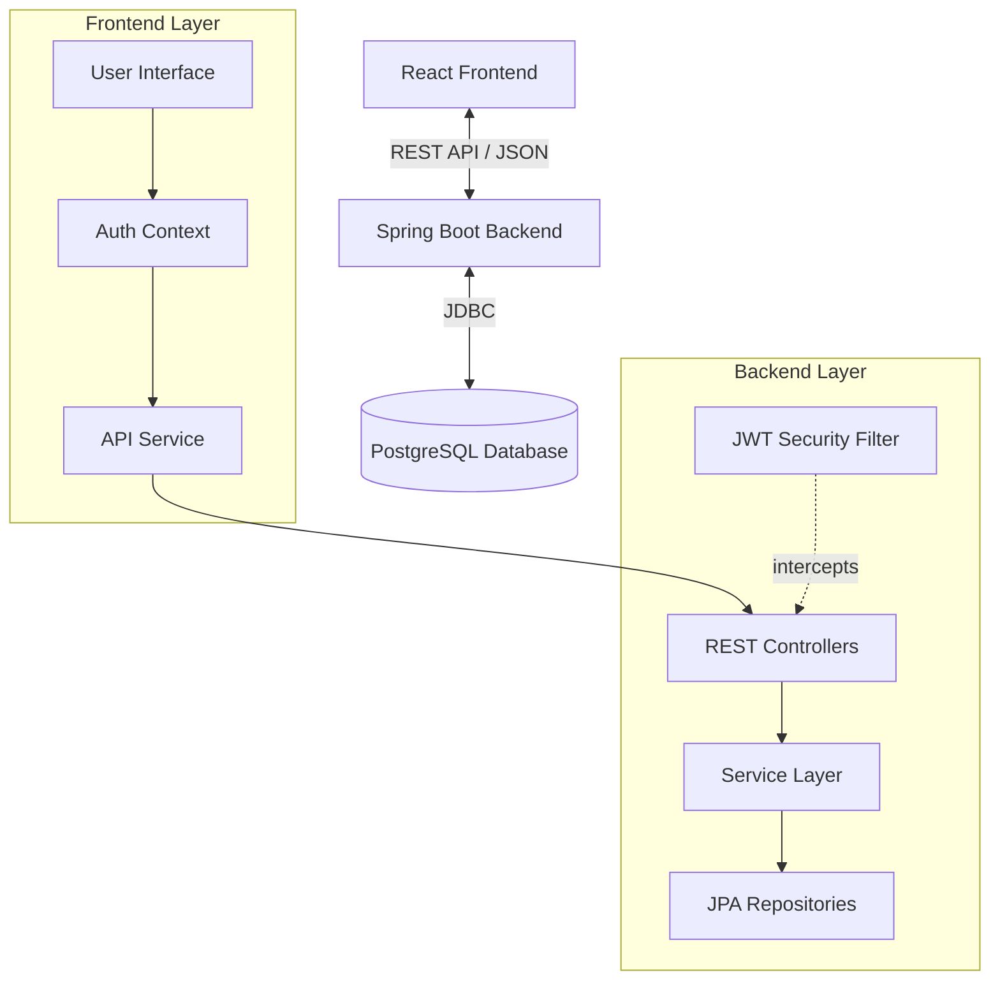

# 📝 Task Manager Application

A premium, full-stack **Task Manager Application** built to help users organize their daily goals efficiently. Featuring a modern "Dark Mode" UI, secure JWT authentication, and a robust Spring Boot backend.

# Task Manager Dashboard
< img width="1920" height="1080" alt="image" src="https://github.com/user-attachments/assets/038872f5-1dac-4dc2-ab9c-22e4c4c1e691" />


---

## 🚀 Tech Stack

### **Frontend**
*   **Framework**: React (Vite)
*   **Styling**: Custom CSS with CSS Variables (Premium Dark Theme)
*   **Icons**: Lucide React
*   **State Management**: React Context API (`AuthContext`, `ThemeContext`)
*   **Routing**: React Router DOM

### **Backend**
*   **Framework**: Spring Boot 3.x
*   **Language**: Java 17+
*   **Security**: Spring Security + JWT (JSON Web Tokens)
*   **Database ORM**: Spring Data JPA (Hibernate)
*   **Build Tool**: Maven

### **Database**
*   **Type**: PostgreSQL
*   **Hosting**: Neon DB (Cloud PostgreSQL)

---

## 📂 Folder Structure

```
TaskManager APP/
├── 📂 backend/                 # Spring Boot Backend
│   ├── src/main/java/com/example/taskmanager/
│   │   ├── 📂 config/          # Security & App Config (JwtFilter, SecurityConfig)
│   │   ├── 📂 controller/      # REST Controllers (AuthController, TaskController)
│   │   ├── 📂 model/           # JPA Entities (User, Task)
│   │   ├── 📂 repository/      # Data Access Layer (UserRepository, TaskRepository)
│   │   └── 📂 service/         # Business Logic (AuthService, TaskService)
│   ├── src/main/resources/
│   │   └── application.properties # DB & JWT Configuration
│   └── pom.xml                 # Maven Dependencies
│
├── 📂 frontend/                # React Frontend
│   ├── src/
│   │   ├── 📂 components/      # Reusable UI (Navbar, etc.)
│   │   ├── 📂 context/         # Global State (Auth, Theme)
│   │   ├── 📂 pages/           # Views (Login, Register, Dashboard)
│   │   ├── 📂 services/        # API Integration (Axios/Fetch wrappers)
│   │   ├── App.jsx             # Main Router Setup
│   │   └── index.css           # Global Premium Styles
│   ├── package.json            # NPM Dependencies
│   └── vite.config.js          # Vite Configuration
│
└── README.md                   # Project Documentation
```

---

## 🔄 User Flow

1.  **Onboarding**:
    *   User lands on the **Login Page**.
    *   New users navigate to **Sign Up** to create an account.
    *   Upon success, they are redirected to Login.

2.  **Authentication**:
    *   User enters credentials.
    *   Backend validates and issues a **JWT Token**.
    *   Token is stored securely (LocalStorage/Memory) for session management.

3.  **Dashboard (Protected Route)**:
    *   User sees a summary of **Pending Tasks**.
    *   **Create Task**: Opens a premium modal/panel to add a new task title and description.
    *   **View Tasks**: Tasks are displayed in a responsive grid layout.
    *   **Interact**:
        *   Click **Status Pill** or Checkbox to toggle "Completed".
        *   Click **Delete Icon** to remove the task.

---

## 🏗 High Level Design (HLD)

The application follows a standard **Client-Server Architecture**:



1.  **Client-Side**: The React app handles the UI rendering and state. It makes asynchronous HTTP requests to the backend using the stored JWT for authorization.
2.  **Security Layer**: The Spring Security filter chain intercepts every request. It validates the `Authorization: Bearer <token>` header before allowing access to the controllers.
3.  **Business Layer**: Services handle the core logic (e.g., creating a task, hashing passwords).
4.  **Data Layer**: Spring Data JPA talks to the PostgreSQL database to persist Users and Tasks.

---

## 🛠 Setup & Installation

### Prerequisites
*   Java JDK 17+
*   Node.js & npm
*   Maven

### 1. Backend Setup
```bash
cd backend
# Update application.properties with your DB credentials if needed
mvn spring-boot:run
```
*The server will start on `http://localhost:8080`*

### 2. Frontend Setup
```bash
cd frontend
npm install
npm run dev
```
*The app will run on `http://localhost:5173`*

---

## ✨ Features
*   **Premium Dark UI**: A carefully crafted dark theme with glass-morphism effects.
*   **Responsive Design**: Works on desktop and mobile.
*   **Secure**: Industry-standard JWT authentication.
*   **Real-time Feedback**: Instant status updates and smooth animations.

---

Made with ❤️ by [Rajveer Sharma]
